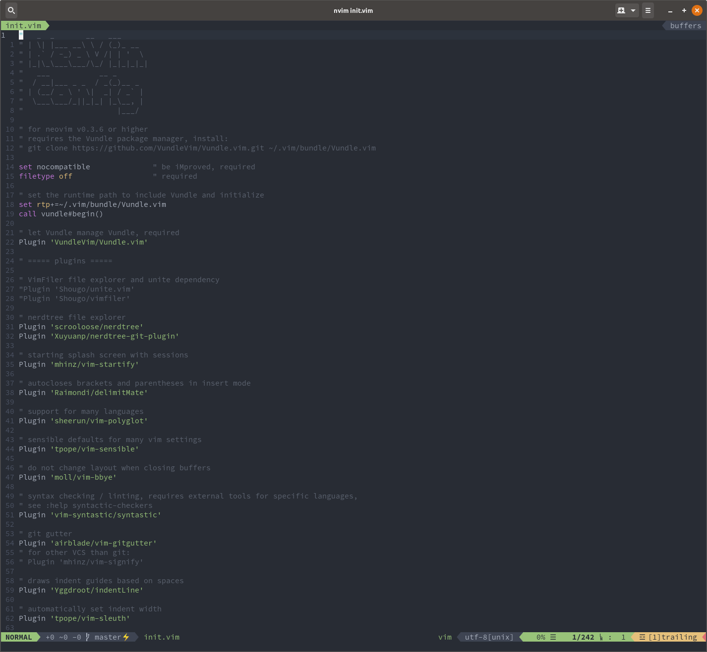

# neovim-config
My personal neovim config.

Requires a powerline font, I use nerd-fonts: https://nerdfonts.com/

Should be cloned to your home directory, then run the install script, that will create the directory ~/.config/nvim and symlink ~/neovim-config/init.vim to ~/.config/nvim/init.vim.

Uses the Vundle package manager.

Update plugins by running: nvim +PluginInstall +PluginUpdate +UpdateRemotePlugins +qa

# Screenshot:

