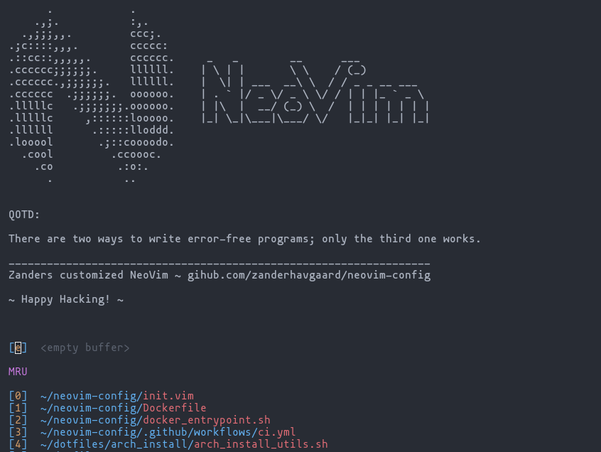
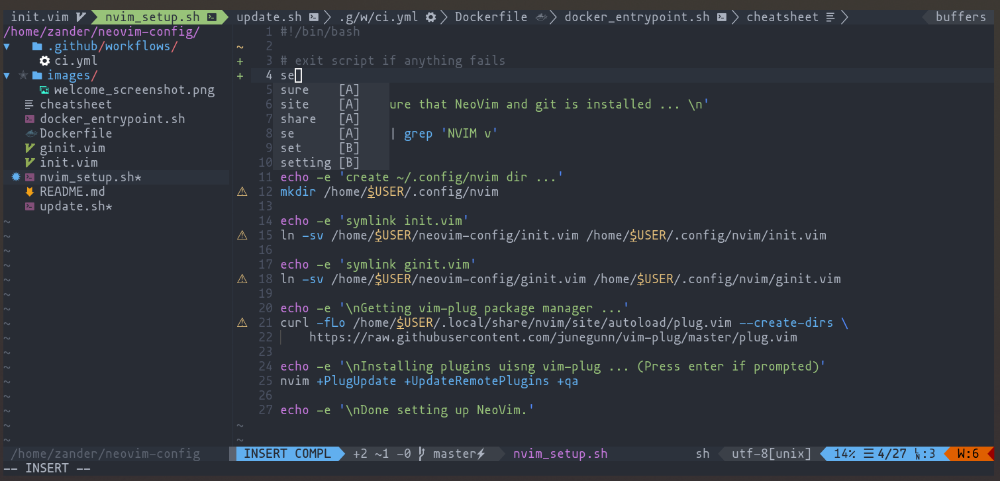

# NeoVim Configuration
My personal neovim config.

## Setup
Requires a powerline font, I use nerd-fonts: https://nerdfonts.com/

Some of the plugins rely on python 3, so in order to run the setup script you must have python 3 installed on your path as `python`, same with a pip installation that points to that python interpreter on the path as `pip`.

The startify start page uses figlet and fortune, you should install those as well, or just delete lines that specify `startify_custom_header`.

Run the install script `nvim_setup.sh` to create the initial installation, then whenever you want to update the installation run the update script `update.sh`.

