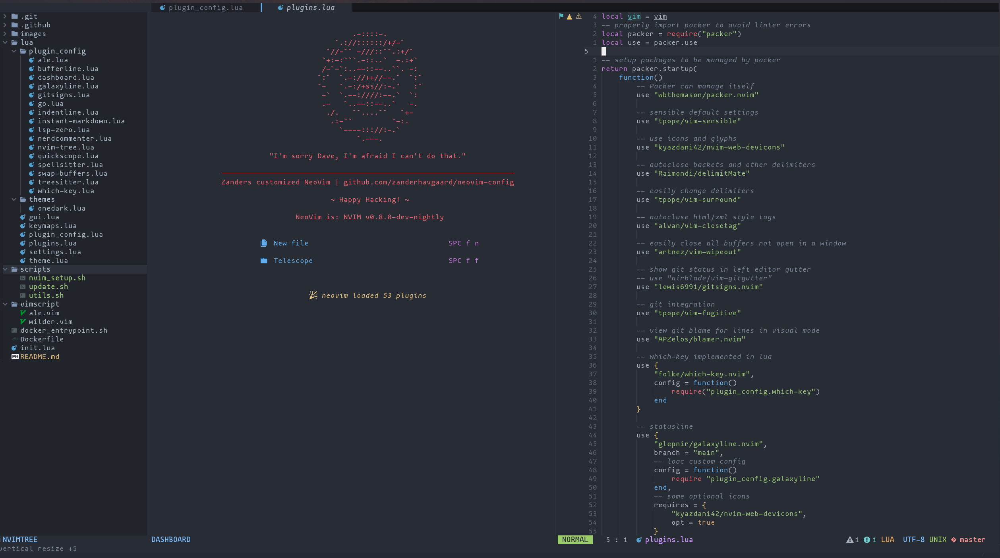

# NeoVim Configuration



## Setup

Requires a powerline font, I use nerd-fonts: https://nerdfonts.com/ (font in the screenshots in Mononoki)

Some of the plugins rely on python 3, so in order to run the setup script you must have python 3 installed on your path as `python`, same with a pip installation that points to that python interpreter on the path as `pip`.

Run the install script `scripts/nvim_setup.sh` to create the initial installation, then run the `scripts/update.sh` to install/update plugins and python dependencies, then whenever you want to update the installation in-place, run the update script `scripts/update.sh`.

## Run in Docker / zcli

You can use the `zanderhavgaard/zcli` docker image to run my nvim configuration in a container, it also comes with my zsh configuration and a selection of cli tools.

The image is built using Github Actions on pushes to master of this repository, and then pushed to docker hub.
You can also build the image yourself using the Dockerfile.

The image expects you to mount a directory with files you are working on to the path `/workspace`

You can do something like the following to run an interactive container:

```bash
docker run --rm -it -v $(pwd):/workspace zanderhavgaard/zcli
```

Create an alias:

```bash
alias zcli='docker run --rm -it -v `pwd`:/workspace zanderhavgaard/zcli'
```

(note the specific syntax to avoid the `pwd` command from being expanded prematurely)


